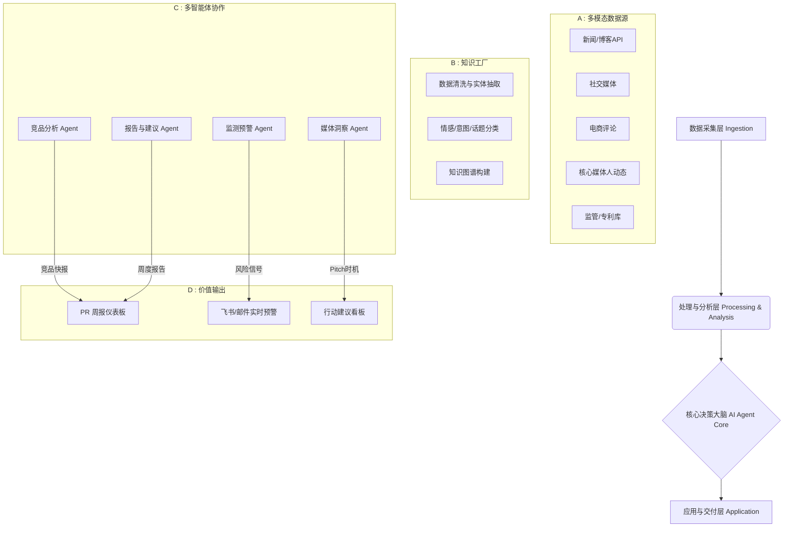

好的，我们已针对你的需求进行了深度探查与推演。以下是围绕 **Momcozy 品牌 PR 运营管理部** 的完整方案，涵盖价值场景、洞察框架、数据架构、功能及产品设计，并最终落地为一份可执行的 AI Agent 驱动的 PR Intelligence 机制。

---

# Momcozy PR Intelligence AI Agent 深度落地方案
**“从媒体监测到 PR 行动，不止搜新闻，更给判断与策略”**

## 一、 方案背景与战略目标
Momcozy 作为全球化的母婴 DTC 品牌，身处“科技+喂养”的高热度赛道，媒体环境复杂多变。传统的舆情监测只解决了“发生了什么”，但 PR 部门真正需要的是**判断力**和**下一步动作**。
本方案旨在构建一套 **AI Agent 驱动的 PR 智能情报系统**，核心回答三个问题：
1.  **现在：** 媒体和行业正在关注什么？Momcozy 的位置在哪里？
2.  **所以呢：** 这些信息对品牌意味着哪些机会和威胁？
3.  **怎么做：** 我们的 PR 团队具体应该采取什么行动（Pitch、Seeding、风险干预）？

最终交付物为**每周 PR Intelligence Report** 及 **实时风险预警**。

---

## 二、 PR AI Agent 价值场景全景图
基于 Momcozy 的业务特性，该 Agent 将在以下场景释放核心价值：

| 价值板块                     | 具体价值场景                                                 | 对 Momcozy 的业务意义                                        |
| :--------------------------- | :----------------------------------------------------------- | :----------------------------------------------------------- |
| **品牌声誉管理与健康度诊断** | 1. **全媒体声量 & 情感追踪**：按周监测品牌在全球媒体/博客的提及量与好感度趋势。 2. **核心信息渗透率分析**：量化“Comfortable & Hands-Free”、“FDA Cleared”、“Science-backed”等自有核心话术在媒体中的采用比例。 | 精确衡量 PR 传播活动的效果，诊断品牌关键信息是否有效触达，避免“自说自话”。 |
| **竞品攻防与差异化卡位**     | 3. **竞品动态作战地图**：实时抓取 Elvie, Willow, Medela 等竞品的新品发布、融资、高管变动及媒体测评，生成竞争态势简报。 4. **评测对比缺口发现**：识别市场上缺乏 Momcozy 与头部竞品“硬核横评”的内容真空区。 | 抓住竞品负面窗口期（如 Willow 的召回事件）进行安全优势传播；在竞品被夸赞时，找到 Momcozy 不可替代的切入点进行回击。 |
| **媒体关系拓展与精准 Pitch** | 5. **核心媒体人档案与选题预测**：跟踪《Parents》、《What to Expect》、Wirecutter 等关键编辑的社交动态与近期发文，预判其未来2-4周的选题。 6. **Pitch 时机建议**：当编辑刚发完竞品差评或提出“最佳静音吸奶器”疑问时，自动提示“Pitch Momcozy M5 静音技术”的机会。 | 从“群发通稿”转向“基于需求的精准狙击”，极大提升媒体回复率与产品借势测评的成功率。 |
| **内容策略与议题设定**       | 7. **行业升温话题挖掘**：从科技、健康、生活方式等跨圈层媒体，发现如“哺乳期职场歧视”、“可穿戴设备与产后心理健康”等值得品牌发声的社会议题。 8. **UGC/测评反哺内容**：抓取 YouTube/TikTok 上素人测评的核心观点，转化为官方传播素材。 | 帮助 Momcozy 跳出狭义的“泵奶器”功能宣传，进入“女性赋能”等高级叙事，提升品牌好感与文化影响力。 |
| **危机预警与风险防火墙**     | 9. **早期风险信号捕获**：在“泵奶器痛感”、“材料过敏”、“电池续航投诉”等负面讨论从小众论坛发酵到主流媒体前，进行拦截预警。 10. **监管与质量风险扫描**：监测 FDA、CPSC 及类似消费者组织的召回、安全通报，并自动对标 Momcozy 产品线。 | 为 PR 争取 24-72 小时的黄金应对时间，将潜在危机化解在萌芽，保护“安全母婴”的品牌根基。 |
| **战略决策支持**             | 11. **新市场进入舆情评估**：在考虑进入德国/日本市场时，Agent 能输出当地媒体对“可穿戴吸奶器”品类的态度与关键议题。 | 为品牌全球化战略提供基于舆情事实的“入场温度计”。             |

---

## 三、 深度洞察框架：从数据到回答
为实现“监测→洞察→行动”的闭环，Agent 内部需构建三层分析模型：

### 1. 品牌/行业/竞品分析层（广度扫描）
- **数据输入**：全球英文新闻、科技博客、母婴垂媒、Reddit 子版块 (r/breastfeeding, r/BabyBumps)、Instagram/TikTok 上的母婴 KOL、Amazon/Walmart 售后评论、专利数据库。
- **洞察回答**：
  - **媒体关注内容**：提取被频繁提及的 Momcozy 产品（如 V1, S12 Pro）及其关联属性（“疼痛”、“大力”、“性价比高”）。对比竞品 Willow Go 则被提到“漏奶”、“贵但设计好”。
  - **升温趋势**：通过 NLP 主题建模，识别近期突增话题，如 “Wearable Pump through TSA”（穿戴泵过安检）、“Elvie Stride vs. Momcozy S12”。
  - **风险信号**：利用细粒度情感分析，抓取与“疼痛/皮疹/烧毁”等安全词共现的品牌名，并标记发帖人影响力等级。

### 2. 核心媒体洞察层（深度穿透）
- **目标列表**：《Wirecutter》(NYT), 《Parents》, 《What to Expect》, 《Babygearlab》, 《Good Housekeeping》, 《Forbes Health》, 以及 YouTube 头部母婴测评人（如 *New Little Life* 的 Allison）。
- **编辑器追踪**：
  - **内容监测**：抓取编辑个人推特、LinkedIn、Muck Rack 档案，以及其署名文章。
  - **观点提炼**：当编辑在推文中抱怨“收到的奶瓶全是塑料味”，或文章中提到“可惜没测到 Momcozy”，系统自动判定为 **“Pitch 机会信号”**。
  - **态度判断**：分析编辑对竞品的历年测评，建立其对“泵奶效率 vs. 舒适度”的偏好权重，判断其为“参数派”还是“体验派”。

### 3. 洞察到 PR Action 的转化层（决策核心）
基于上述信号，Agent 将自动匹配 PR 行动库：
- **信号类型：竞品重大负面（如召回）**
  - **Action**：立即生成 Media Alert 草案，强调 Momcozy 相关的安全认证与品质把控，并推荐 Pitch 给已报道此事的媒体记者，提供对比测评样机。
- **信号类型：核心编辑的选题疑问**
  - **Action**：提示 PR 人员以 “Expert Comment” 形式介入，并提供 Momcozy 内部研发专家的观点摘要，而非直接产品推销。
- **信号类型：新兴正面社会议题（如“立法保障职场泵奶权”）**
  - **Action**：建议策划 Momcozy 高管署名文章 (Op-ed) 或联合妇女组织发起倡议，并输出一份媒体邀约名单。

---

## 四、 产品架构与技术方案
为实现上述业务功能，我们设计以下 AI Agent 产品架构：

### 1. 总体架构图

### 2. 数据架构设计
- **基础层**：
  - **自采数据库**：基于 Scrapy 的集群，针对性采集重点媒体、论坛、社交平台。
  - **商业数据 API**：接入 Meltwater/Cision（如果已有）用于全球新闻，NewsAPI 作为补充，Reddit/YouTube API 获取社交声量。
  - **电商网关**：抓取亚马逊、Walmart 站内 Momcozy 及竞品的问题与好评。
- **知识层**：
  - **Momcozy 知识图谱**：包含品牌、产品线 (S12, M5)、核心技术 (双重密封, 变频)、高管、代言人、核心话术。
  - **竞品知识图谱**：Willow, Elvie 等的产品、特征、知名负面（标签化）。
  - **媒体人图谱**：记者-媒体-行业-偏好-历史交互记录。
- **向量数据库**：所有文章、评论经 Embedding 后存入 Milvus，用于话题聚合、语义搜索，如查找所有“有关泵奶器声音大小”的讨论。

### 3. AI Agent 核心工作流设计
采用 **多 Agent 协作模式**，基于 LangGraph 框架编排：

- **周一 00:00 周报生成流程**：
  1.  **调度 Agent** 触发任务。
  2.  **监测 Agent** 清洗过去 7 天数据，生成统计概览。
  3.  **分析 Agent** 识别 Top5 涨跌幅的话题、情感突变品牌、新高频词。
  4.  **媒体洞察 Agent** 针对30家核心媒体，提炼其编辑部的变化与潜在切角。
  5.  **策略 Agent** 将以上发现交叉比对，依据预置规则库和 LLM 推理，生成10-15条具体的 PR 行动建议，并附上“为什么这么做”的解释。
  6.  **报告 Agent** 将所有结果融合为 Markdown/PDF 格式的《Momcozy 每周 PR 智能情报》，自动推送到指定邮箱和飞书群。

- **实时预警流程**：
  - **触发条件**：任一品牌负面提及在1小时内声量增速超200%，或匹配到“召回/受伤/FDA警告”等关键词，且发布源权重 (PageRank) 较高。
  - **行动**：预警 Agent 即刻生成简报，包含原文、风险评级 (P1-P3)、发酵路径预测、建议回应口径，并 @ PR 负责人。

### 4. 业务功能模块详述
**前端看板 (Web Dashboard)**
- **品牌仪表盘**：声量/情感趋势图，品牌核心信息渗透率，竞品雷达图。
- **核心媒体中心**：30家重点媒体的动态瀑布流，每个媒体档案卡标注“最近关注点”和“Pitch建议”标签。
- **信号 & 行动中心**：一个类 Trello 的看板，分列“发现的机会”、“确认的风险”、“已执行的行动”，PR 团队可拖拽并更新状态。
- **报告生成器**：支持自定义时间、专题，一键导出。

**后台管理**
- **监测主题管理**：灵活增减竞品、关键词、核心媒体列表。
- **PR 规则库配置**：自定义“如果监测到 X 信号，则建议 Y 行动”的 if-this-then-that 逻辑，让 Agent 越来越懂 Momcozy 的 PR 策略。
- **专家 & 样机库**：管理可对外沟通的专家清单、产品样机库存，在建议 Product Seeding 时能自动关联可用资源。

---

## 五、 核心交付物：每周 PR Intelligence Report 模板
通过 Agent 自动生成，PR 团队可微调后直接用于周会决策。

### **Momcozy 周度 PR 情报报告 (2024.05.13 - 2024.05.19)**
#### **1. 执行摘要**
本周品牌声量环比上升12%，正面情感占主导（78%）。竞品 Elvie 因“配件昂贵”在 Reddit 引发热议，为 Momcozy 提供了性价比传播的绝佳窗口。需紧急关注一起在母婴论坛中酝酿的 S12 护罩兼容性讨论。

#### **2. 媒体全景扫描**
- **Top 升温话题**:
  - #WearablePumpUnder100 (来自 Wirecutter 最新读者问答)
  - #NursingClothesWithPumpingAccess (生活方式媒体兴起)
- **竞品重大动态**:
  - **风险:** Willow 被《Babygearlab》评测指出“泵奶效率低于宣传值”。
  - **机会:** Medela 新广告因“暗示奶瓶喂养更方便”引发妈妈社群反感，Momcozy 可借机强化“支持所有喂养方式”的包容形象。

#### **3. 核心媒体洞察**
- **《Parents》杂志编辑 L.Smith**：
  - **动态**：最近在LinkedIn上征询“回归职场泵奶装备”建议。
  - **评价**：其过去对 Momcozy S12 的评价为“解放双手但略重”。
  - **Pitch 建议**：**立即联系，提供全新的超轻量 M5 进行试用**，角标紧扣“职场妈妈轻松之选”。

#### **4. 机会与行动建议**
| 优先级 | 洞察来源            | 机会/风险描述                                                | **PR 行动建议**                                              | 建议执行动作                                 |
| :----- | :------------------ | :----------------------------------------------------------- | :----------------------------------------------------------- | :------------------------------------------- |
| **高** | 竞品 Elvie 配件贵   | **机会**：消费者对“高性价比可穿戴泵”产生强烈诉求。           | **内容合作**：联合省钱类母婴博主，推出《如何用一半预算配齐专业级移动泵奶方案》专题。 | 立即联系3位预算主题 KOC，寄送 S12 Pro 样机。 |
| **中** | 编辑 L.Smith 的动态 | **机会**：精准触达核心编辑当前选题需求。                     | **产品 Seeding**：24小时内寄出 M5，随附手写卡片突出其“193g 超轻机身，专为职场妈妈设计”。 | PR 专员 XX 今日完成寄送并发送预热邮件。      |
| **低** | 论坛兼容性讨论      | **风险**：小范围讨论 S12 与某些奶瓶不适配，有向电商评论区蔓延的趋势。 | **被动监测升级**：准备 Q&A 技术答疑材料，无需主动出击，但需监控是否跨平台扩散。 | 转发客服部门知情，PR 内部标记关注。          |

---

## 六、 落地执行路线图与保障

### 阶段一：MVP 快速上线（1-2月）
- **目标**：跑通“监测→周报”闭环。
- **范围**：聚焦 5 大竞品，20 家核心媒体，3个Reddit子论坛。手动配置核心关键词和媒体人。交付每周手动一键生成的《PR情报简报》。
- **技术栈**：Python (FastAPI) + GPT-4o + 简单的新闻API + 飞书通知。

### 阶段二：增强分析与人机协同（3-4月）
- **目标**：上线动态看板，开启实时预警，完善 Action 建议。
- **范围**：引入编辑社交媒体追踪，电商数据源。PR 团队开始频繁使用行动建议看板，并反馈规则，优化 Agent 的推荐逻辑。

### 阶段三：全量智能决策辅助（5-6月+）
- **目标**：Agent 不仅能给建议，能直接生成 Pitch 邮件草稿、测评大纲。从“辅助”向“半自动化执行”进化。
- **关键衡量指标 (KPIs)**：
  - **预警时效性**：负面信号从出现到 PR 收到预警 < 60分钟。
  - **报告使用率**：PR 团队每周基于 Agent 建议采取 >= 3 项具体行动。
  - **Pitch成功率**：基于 Agent 时机建议的媒体 Pitch，回复率提升 30% 以上。
  - **媒体渗透率**：季度品牌核心信息在 Top 媒体中出现的频次持续上升。

通过此方案，Momcozy 的 PR 部门将转型为数据驱动、先知先觉的“品牌情报指挥中心”，在激烈的母婴赛道中建立起一道由 AI 驱动的 PR 护城河。