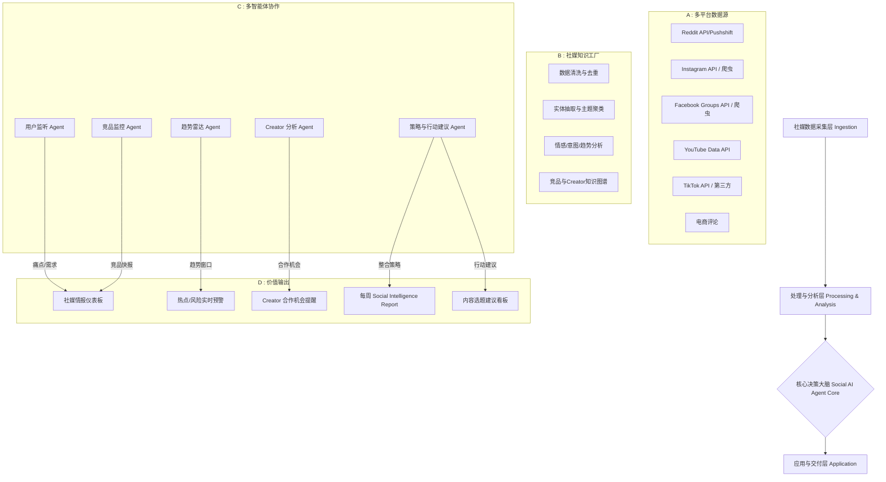

# Momcozy Social Intelligence AI Agent 深度落地方案

**“从社媒监测到内容行动，不止看热闹，更给判断与打法”**

---

## 一、方案背景与战略目标

Momcozy 作为全球领先的母婴科技 DTC 品牌，社媒是其用户沟通、内容种草与品牌建设的核心阵地。然而，当前社媒团队面临三大挑战：

- **信息过载**：Reddit、TikTok、Facebook Groups 等平台海量讨论，人工难以全面追踪。
- **洞察滞后**：竞品动作、平台趋势变化极快，传统周报式复盘已无法支撑实时决策。
- **执行断层**：监测团队与内容团队割裂，数据报告无法直接转化为可执行的内容创意与运营动作。

本方案旨在构建一套 **AI Agent 驱动的 Social Intelligence 系统**，核心回答三个问题：

1. **用户现在在聊什么？** 他们的真实需求、痛点、使用场景是什么？
2. **竞品和平台在发生什么？** 哪些内容打法有效？哪些趋势值得跟进？
3. **我们接下来应该做什么？** 具体的内容创意、Creator 合作、互动回应建议。

最终交付物为 **每周 Social Intelligence Report** 及 **实时热点/风险预警**，让社媒团队从“被动救火”转向“主动策划”。

---

## 二、Social Intelligence AI Agent 价值场景全景图

围绕 Momcozy 社媒业务特性，该 Agent 将在以下场景释放核心价值：

| 价值板块 | 具体价值场景 | 对 Momcozy 的业务意义 |
| :--- | :--- | :--- |
| **用户声音与需求挖掘** | 1. **全平台用户讨论聚合**：实时抓取 Reddit、Facebook Groups、TikTok 评论区等用户自然讨论，按主题、产品、场景聚合。 2. **痛点与需求图谱构建**：识别高频痛点（如“穿戴泵漏奶”“清洗麻烦”）、未满足需求（如“出差便携消毒”）、新使用场景（如“自驾途中泵奶”）。 3. **舆论风险早期预警**：捕捉用户对产品安全、质量、体验的集中抱怨，在发酵前通知团队。 | 为产品迭代、内容选题、客服话术提供一手用户洞察；避免负面情绪在社媒扩散。 |
| **竞品社媒动作拆解** | 4. **竞品官方账号内容监控**：追踪 Elvie、Willow、Medela 等竞品在 Instagram、TikTok、YouTube 的官方发布，标记高互动内容。 5. **爆款内容归因分析**：对表现突出的竞品内容进行主题、形式、钩子、投放策略拆解，提炼可复用打法。 6. **竞品 Campaign 实时追踪**：监测竞品节点营销、联名合作、UGC 活动，判断其阶段性策略重点。 | 知己知彼，快速复制有效打法，避开竞品已验证的低效内容。 |
| **平台趋势与热点捕捉** | 7. **跨平台趋势雷达**：监测 TikTok、Instagram Reels、YouTube Shorts 热门 Hashtag、BGM、内容模板，判断热度上升速度。 8. **母婴垂类趋势识别**：从泛娱乐趋势中筛选与母婴人群、喂养场景、新手妈妈生活方式相关的可迁移趋势。 9. **参与时间窗口建议**：基于趋势生命周期模型，提示“现在跟进”或“已过热，放弃”。 | 让品牌内容始终踩在平台流量风口，提升自然曝光与互动。 |
| **重点 Creator/KOL 深度分析** | 10. **Creator 内容动态追踪**：对重点关注的母婴垂类 KOL，持续抓取其视频内容，分析近期创作方向、内容形式变化。 11. **受众反馈与商业合作洞察**：分析 Creator 评论区互动质量、合作品牌调性，判断其商业价值与匹配度。 12. **合作机会自动推荐**：当 Creator 发布与 Momcozy 产品相关或需求匹配的内容时，自动提示合作窗口。 | 精准筛选高潜力合作对象，提高 Creator 合作 ROI，避免无效投放。 |
| **社媒策略决策支持** | 13. **内容方向建议生成**：综合用户需求、竞品动作、平台趋势，自动生成下周内容选题建议（含角度、形式、参考案例）。 14. **社群运营辅助**：针对 Facebook Groups / Reddit 中的高频问题，自动生成官方回应口径建议，维护品牌口碑。 | 让社媒团队从执行者升级为策略制定者，提升内容命中率和用户粘性。 |

---

## 三、深度洞察框架：从数据到回答

为实现“监测 → 洞察 → 行动”的闭环，Agent 内部构建三层分析模型：

### 1. 用户讨论与需求洞察层（Social Listening）

**数据输入**：
- Reddit（r/breastfeeding, r/BabyBumps, r/ExclusivelyPumping, r/NewParents 等）
- Facebook Groups（Momcozy 官方社群、自然育儿群、职场妈妈群等）
- Instagram/TikTok/YouTube 的评论区、@提及、话题标签内容
- 电商评论（Amazon、Walmart 可作为补充）

**分析方法**：
- **主题聚类**：使用 BERTopic 等无监督学习，将海量帖子聚类为“泵奶效率”“舒适度”“便携性”“噪音”“清洁”等主题，并跟踪各主题的声量变化。
- **情感与意图识别**：区分“求助”“抱怨”“推荐”“对比”等意图。例如，识别到“求助：如何清洁阀门”的帖子激增，提示内容团队制作清洁教程。
- **痛点-场景矩阵**：构建“场景 × 痛点”二维表，识别高频组合。例如，“职场背奶 + 泵奶声音大”组合未被竞品内容覆盖，即是内容机会。
- **升温话题检测**：基于时间序列的突发词检测，标记 7 天内讨论量增长 >200% 的话题。

**洞察回答**：
- 用户在讨论什么？最关注什么问题？
- 有哪些新需求、痛点被反复提及？
- 有哪些话题热度正在快速上升，值得品牌跟进或回应？

### 2. 竞品社媒营销动作监控层

**数据输入**：
- 竞品官方 Instagram、TikTok、YouTube、Facebook 账号
- 竞品合作 Creator 的内容（通过标签、@提及识别）
- 竞品广告投放（可选，通过第三方广告库如 Meta Ad Library）

**分析方法**：
- **内容分类体系**：将竞品内容自动打标，包括内容类型（教程、UGC、产品展示、情感故事、促销）、创意形式（口播、剧情、对比测评、Vlog）、传播角度（省时、舒适、自由、科学）。
- **爆款识别与归因**：设定互动率阈值（如 Instagram 互动率 > 3% 或 TikTok 播放量 > 50万），对高表现内容进行多维度拆解，输出“爆款要素组合”。
- **Campaign 检测**：通过内容发布时间、标签、文案模式识别竞品阶段性 Campaign（如母亲节活动、新品预热），并输出时间线分析。

**洞察回答**：
- 竞品最近在重点推广什么主题？使用了哪些内容形式？
- 哪些内容表现突出？可能的成功原因是什么？
- 有哪些内容打法值得借鉴？存在什么差异化切入机会？

### 3. 社媒热点与内容趋势洞察层

**数据输入**：
- TikTok Creative Center（官方趋势数据）
- Instagram Reels 热门音频、话题标签
- YouTube Trending / Shorts 热门内容
- 母婴垂类 KOL 近期发布的爆款内容
- 第三方趋势工具（如 Glimpse、Exploding Topics，可作为补充）

**分析方法**：
- **趋势生命周期模型**：将每个趋势标记为“萌芽期”“上升期”“爆发期”“衰退期”，基于热度增长率判断参与时间窗口。
- **趋势迁移适配度评估**：对跨领域趋势（如美食、健身、职场类）进行“母婴相关性”评分，判断是否适合 Momcozy 跟进。
- **内容模板拆解**：对于流行内容模板，提取其结构要素（如“3 个新手妈妈不知道的隐藏技巧”），便于团队快速套用。

**洞察回答**：
- 最近有哪些社媒趋势正在升温？
- 哪些趋势与母婴人群、品牌目标用户相关？
- 品牌是否适合参与？可以从什么角度切入？

### 4. 重点 Creator/KOL 内容分析层

**数据输入**：
- 社媒团队维护的重点 Creator 名单（可手动增删）
- 其发布在 TikTok、Instagram、YouTube 的视频内容
- 评论区高赞留言、互动数据

**分析方法**：
- **Creator 内容指纹**：为每个 Creator 建立标签档案，包括内容主题分布、形式偏好、合作品牌列表、受众画像（基于评论和粉丝数据推测）。
- **内容表现对比**：对 Creator 近期视频进行互动数据排名，识别其“内容舒适区”和“新尝试方向”。
- **商业内容识别**：通过文案中的 #ad、#sponsored 标签及品牌提及，识别其商业合作频率与品牌调性，评估合作匹配度。
- **变化检测**：对比过去 3 个月与近 2 周的内容方向，判断其是否转型或拓展新领域。

**洞察回答**：
- 重点 Creator 最近在关注和创作什么？
- 哪些内容方向表现较好？受众反馈如何？
- 是否存在合作机会或内容选题启发？

### 5. 洞察到 Social Media Action 转化层

基于前四层洞察，Agent 输出可执行的动作建议，并标记优先级：

| 洞察来源 | 洞察示例 | **Social Media Action** | 执行建议 |
| :--- | :--- | :--- | :--- |
| **用户讨论** | Reddit 上关于“泵奶时如何解放双手开会”的帖子增多 | **内容创作**：制作一条“职场妈妈线上会议泵奶隐藏技巧”短视频，针对远程办公场景 | 本周内由 TikTok 团队拍摄，采用原生感口播形式 |
| **竞品动作** | 竞品 Elvie 在 Instagram 高频发布“妈妈夜奶”情感故事内容，互动高 | **内容策略**：差异化切入“爸爸视角夜奶”故事，突出 Momcozy 可穿戴设计让妈妈更轻松 | 下周策划一条夫妻对话情景短剧，投稿至 Instagram Reels |
| **平台趋势** | TikTok 上“Silent Vlog”无声生活记录趋势正在上升，母婴垂类尚未大量跟进 | **趋势跟进**：以“无声泵奶一小时”为主题，发布沉浸式无声视频，展示产品静音优势 | 3 天内完成脚本，7 天内发布，抢占趋势窗口 |
| **Creator 洞察** | 重点 Creator 近期高频发布“产后身材恢复”内容，评论区互动热烈 | **合作机会**：联系该 Creator，提供 Momcozy M5 样机，邀请其围绕“舒适泵奶与产后恢复”创作内容 | 由 Influencer 团队 24 小时内触达，附赠品牌定制礼盒 |
| **风险信号** | Facebook Group 中多名用户抱怨 S12 护罩易变形 | **社群回应**：生成官方回应口径，说明正确清洗方法，并考虑提供免费替换配件 | 客服团队同步，社媒团队发布“产品保养小贴士”帖子，避免负面扩散 |

---

## 四、产品架构与技术方案

### 1. 总体架构图

### 2. 数据架构设计

**数据采集层**：
- **Reddit**：使用 Reddit API 结合 Pushshift 历史数据，重点监测 10 个母婴相关 Subreddit，并支持自定义添加。
- **Facebook Groups**：通过合规的 Facebook Graph API 或第三方社媒监测工具（如 Brandwatch、CrowdTangle 替代品）获取公开群组帖子与评论。
- **Instagram**：使用 Instagram Graph API 抓取竞品官方账号、品牌话题标签下的公开内容，以及目标 Creator 内容。
- **YouTube**：使用 YouTube Data API v3 抓取竞品频道、母婴垂类 Creator 的视频元数据、评论、互动数据。
- **TikTok**：使用 TikTok Research API（如已开放）或第三方服务（如 Pentos、Cureight）获取趋势、竞品内容、Creator 数据。
- **电商评论**：作为补充，抓取 Amazon/Walmart 上 Momcozy 及竞品产品的用户评论，丰富需求洞察。

**数据存储层**：
- **原始数据湖**：使用 AWS S3 存储原始 JSON 数据，保留完整字段。
- **关系型数据库**：PostgreSQL 存储清洗后的结构化数据，包括帖子、评论、创作者、互动数据等。
- **向量数据库**：Milvus 存储文本 Embedding，用于语义搜索和相似内容聚类。
- **图数据库**：Neo4j 存储 Creator-品牌-话题-平台之间的多关系网络，支持复杂关联分析。

**知识层**：
- **Momcozy 产品知识图谱**：包括产品线（S9, S12, M5, V1 等）、功能特征、核心卖点、常见问题、官方话术。
- **竞品知识图谱**：竞品产品矩阵、营销活动、合作 Creator、内容主题标签。
- **Creator 知识图谱**：重点 Creator 的账号信息、内容主题、合作历史、受众画像、互动数据。
- **趋势知识库**：历史监测到的趋势及其生命周期数据，用于预测新趋势的走向。

### 3. AI Agent 核心工作流设计

采用 **多 Agent 协作模式**，基于 LangGraph 编排：

**每日实时监测流程**：
1. **采集 Agent** 按照预设频率（每 15-60 分钟）从各平台采集新数据。
2. **监听 Agent** 对新增帖子进行实时分类，识别：
   - 负面情绪突增（风险信号）
   - 热点话题突增（趋势信号）
   - 竞品高互动内容（竞品信号）
3. **预警 Agent** 根据预设规则（如负面声量 1 小时增长 >200%，或匹配到“召回”“受伤”等词）触发实时告警，推送至飞书/邮件。

**每周深度报告流程（每周一 06:00）**：
1. **调度 Agent** 触发周报生成任务。
2. **用户监听 Agent** 汇总过去 7 天 Reddit、Facebook Groups 等平台的用户讨论，生成：
   - Top 10 话题及声量变化
   - 新增痛点/需求清单
   - 情感趋势
3. **竞品监控 Agent** 分析竞品官方账号与合作 Creator 的内容，输出：
   - 竞品高互动内容 Top 10
   - 竞品近期 Campaign 时间线
   - 爆款内容归因分析
4. **趋势雷达 Agent** 扫描 TikTok、Instagram、YouTube 趋势，输出：
   - 当前升温趋势 Top 5
   - 母婴相关性评分及参与建议
5. **Creator 分析 Agent** 分析重点 Creator 近 2 周内容，输出：
   - Creator 动态摘要
   - 高表现内容分析
   - 合作机会推荐
6. **策略与行动 Agent** 综合以上洞察，生成：
   - 本周内容选题建议（5-10 个，含角度、形式、参考）
   - Creator 合作建议（3-5 个）
   - 社群回应口径建议
   - 风险与机会预警
7. **报告 Agent** 将所有结果整合为 Markdown/PDF 格式，推送至社媒团队。

### 4. 业务功能模块详述

**前端看板（Web Dashboard）**：
- **用户声音面板**：实时滚动展示 Reddit / Facebook Groups 最新讨论，可按主题、情感、平台筛选。点击任何帖子可查看上下文及 AI 生成的摘要。
- **竞品监控面板**：展示竞品官方账号最新内容、互动数据，高亮标记“高互动内容”并附带归因分析。支持按竞品、平台、时间筛选。
- **趋势雷达面板**：展示当前 TikTok/Instagram/YouTube 热门趋势，标注热度等级、上升速度、母婴相关性评分。提供趋势生命周期曲线图。
- **Creator 分析面板**：展示重点 Creator 列表，点击可查看其近期内容、互动数据、内容标签、合作品牌。高亮标记“合作机会”Creator。
- **内容行动中心**：展示 AI 生成的行动建议，按优先级排序，标注建议来源（用户洞察/竞品洞察/趋势洞察/Creator 洞察）。团队可拖拽至“已采纳”“已执行”“已放弃”，反馈闭环优化 Agent。

**后台管理**：
- **监测目标管理**：灵活增减竞品账号、重点 Creator、Subreddit、Facebook Groups、关键词标签。
- **趋势规则配置**：自定义趋势热度阈值、母婴相关性评分权重、预警触发条件。
- **行动建议模板库**：预置常见社媒行动模板（如内容选题、Creator 合作、社群回应），支持团队自定义修改。
- **品牌资产库**：管理产品卖点、官方素材、样机库存、合作政策，供 Agent 在生成建议时引用。

---

## 五、核心交付物模板

### **Momcozy 每周 Social Intelligence Report（2024.05.13 - 2024.05.19）**

#### 1. 执行摘要
本周用户讨论量环比上升 18%，主要集中在“职场泵奶”和“产品清洁”两大主题。竞品 Elvie 在 Instagram 的情感故事内容获得高互动，值得关注。TikTok 上“无声 Vlog”趋势正在上升，母婴垂类尚未大量跟进，建议本周内跟进。重点 Creator @newlittlelife 近期高频发布“产后恢复”内容，存在合作窗口。

#### 2. 用户讨论与需求洞察
- **本周 Top 5 话题**：
  | 话题 | 声量 | 环比变化 | 情感倾向 | 典型帖子摘录 |
  | :--- | :--- | :--- | :--- | :--- |
  | 职场泵奶 | 234 条 | +42% | 混合 | “如何在不影响会议的情况下泵奶？” |
  | 产品清洁 | 187 条 | +18% | 偏负 | “阀门很难完全晾干，担心发霉” |
  | 穿戴泵舒适度 | 145 条 | +11% | 正面 | “S12 比我想象中轻，戴了 2 小时也不累” |
  | 出差/旅行泵奶 | 98 条 | +67% | 积极 | “带着 M5 出差太方便了，机场安检也顺利” |
  | 泵奶量焦虑 | 76 条 | -5% | 负面 | “用了穿戴泵后总感觉没排空” |

- **新发现痛点/需求**：
  - **需求 1**：职场妈妈希望在 Zoom 会议期间泵奶但不想被听到/看到，需要静音和隐蔽性更强的产品使用指南。
  - **需求 2**：用户对清洁消毒的便捷性关注度上升，期待免拆洗或快速清洗方案。
  - **痛点 1**：部分用户在 Reddit 反映 S12 的阀门在高温消毒后容易变形。

#### 3. 竞品社媒营销动作监控
- **竞品高互动内容 Top 3**：
  | 竞品 | 平台 | 内容主题 | 形式 | 互动数据 | 成功归因 |
  | :--- | :--- | :--- | :--- | :--- | :--- |
  | Elvie | Instagram Reel | “妈妈夜奶真实记录” | 情感 Vlog | 12.4k 点赞，820 评论 | 真实场景+情感共鸣，引发新手妈妈强烈共情 |
  | Willow | TikTok | “泵奶器 3 个隐藏用法” | 技巧口播 | 850k 播放，34k 点赞 | 实用信息+节奏快，符合 TikTok 原生感 |
  | Medela | Instagram | “父亲视角：喂奶不是妈妈一个人的事” | 情景短剧 | 9.8k 点赞，450 评论 | 打破性别刻板印象，引发讨论 |

- **竞品近期 Campaign 时间线**：
  - Elvie 正在预热母亲节情感 Campaign，连续 5 天发布“妈妈夜奶”系列视频。
  - Willow 主推“职场背奶”场景，与多位职场妈妈 KOL 合作。
  - Medela 侧重“科学喂养”角度，联合儿科医生科普。

- **策略建议**：竞品多在情感叙事和实用技巧上发力，Momcozy 可差异化切入“轻松幽默”路线，用情景喜剧形式展示穿戴泵如何解放双手，抢占差异化心智。

#### 4. 社媒热点与内容趋势洞察
- **本周升温趋势 Top 3**：
  | 趋势 | 平台 | 热度等级 | 上升速度 | 母婴相关性 | 参与建议 |
  | :--- | :--- | :--- | :--- | :--- | :--- |
  | #SilentVlog（无声记录） | TikTok | 高 | +130% | 中高 | 制作“无声泵奶一小时”沉浸式视频，展示产品静音和解放双手，建议 3 天内发布 |
  | #WorkingMomLife（职场妈妈生活） | Instagram Reels | 高 | +85% | 高 | 策划“职场妈妈的一天”系列 Reels，突出 Momcozy 可穿戴设计便于通勤泵奶 |
  | #DadLife（奶爸视角） | YouTube Shorts | 中 | +60% | 中 | 拍摄“爸爸如何帮妈妈准备泵奶装备”轻松短剧，吸引家庭受众 |

- **趋势参与时间窗口**：#SilentVlog 处于上升期，预计生命周期 2-3 周，现在跟进最佳。#WorkingMomLife 属于常青话题，可长期规划。

#### 5. 重点 Creator/KOL 内容分析
- **Creator 动态摘要**：
  | Creator | 平台 | 粉丝量 | 近期内容方向 | 高表现内容 | 合作机会 |
  | :--- | :--- | :--- | :--- | :--- | :--- |
  | @newlittlelife (Allison) | YouTube | 286k | 产后恢复 + 泵奶技巧 | “穿戴泵真实测评对比”获 189k 观看 | 极高：其近期内容与 Momcozy 产品高度相关，且评论区多次有人求推荐穿戴泵 |
  | @themomedit | Instagram | 152k | 母婴好物分享 + 生活妙招 | “职场妈妈泵奶装备清单”获 32k 点赞 | 高：可提供 M5 样机，邀请其测评并列入清单 |
  | @pump_momma | TikTok | 89k | 泵奶日常 + 幽默吐槽 | “泵奶时同事突然敲门”搞笑视频获 2.1M 播放 | 中高：适合合作幽默向内容，传递产品隐蔽性 |

- **合作建议**：立即触达 @newlittlelife，提供 M5 样机并邀请其参与“穿戴泵横评”内容。同时，可与 @pump_momma 合作“职场泵奶尴尬瞬间”系列，强化 Momcozy 隐蔽静音卖点。

#### 6. Social Media Action 汇总
| 优先级 | 洞察来源 | 建议行动 | 执行建议 | 负责团队 |
| :--- | :--- | :--- | :--- | :--- |
| **高** | TikTok 趋势 #SilentVlog | 发布“无声泵奶一小时”沉浸式视频，展示 M5 静音与解放双手 | 本周三前完成脚本，周五发布 | TikTok 内容团队 |
| **高** | Creator 洞察 @newlittlelife | 联系合作，提供 M5 样机，邀请参与穿戴泵横评 | 24 小时内触达，附赠品牌礼盒 | Influencer 团队 |
| **中** | 用户洞察：职场泵奶需求 | 制作“线上会议期间隐蔽泵奶”教程内容，针对远程办公妈妈 | 下周发布，配合 Instagram Reels 和 TikTok | 内容策略团队 |
| **中** | 竞品洞察：Elvie 情感故事 | 差异化策划“幽默向”职场泵奶情景短剧，避免正面情感竞争 | 两周内完成脚本创作 | 创意团队 |
| **低** | 用户风险：阀门变形抱怨 | 社群回应：发布“产品保养小贴士”，说明正确消毒方法；同步客服团队 | 本周内发布 | 社群运营团队 |

---

## 六、落地执行路线图与保障

### 阶段一：MVP 快速上线（1-2月）
- **目标**：跑通“监测 → 周报”闭环。
- **范围**：
  - 重点监测 5 个 Subreddit、3 个 Facebook Groups、竞品官方账号（Instagram、TikTok）、10 个重点 Creator。
  - 手动配置关键词、竞品、Creator 名单。
  - 交付每周自动生成的 Social Intelligence Report（基础版）。
- **技术栈**：Python (FastAPI) + GPT-4o + Reddit API + YouTube API + 第三方 TikTok 数据服务 + 飞书通知。

### 阶段二：增强分析与实时预警（3-4月）
- **目标**：上线实时监测看板，开启热点/风险实时预警，完善趋势分析。
- **范围**：
  - 接入 Instagram 和 Facebook Groups 数据（通过第三方工具或合规 API）。
  - 上线趋势雷达模块，提供趋势生命周期模型和参与建议。
  - 增加竞品高互动内容自动标记与归因分析。
  - 团队开始使用行动建议看板，反馈闭环。
- **技术栈**：增加向量数据库 (Milvus)、图数据库 (Neo4j)，引入 BERTopic 进行主题聚类。

### 阶段三：全量智能决策辅助（5-6月+）
- **目标**：Agent 不仅能给建议，能直接生成内容脚本草稿、Creator 合作话术、社群回应模板，从“辅助”向“半自动化执行”进化。
- **关键衡量指标 (KPIs)**：
  - **监测覆盖率**：所有重点平台、Creator、竞品账号覆盖率 100%。
  - **预警时效性**：趋势/风险信号从出现到团队收到提醒 < 30 分钟。
  - **内容命中率**：基于 Agent 建议产出的内容，平均互动率提升 25% 以上。
  - **Creator 合作效率**：合作响应时间缩短 50%，合作 Creator 内容平均互动率高于品牌官方内容 30%。
  - **团队使用率**：每周基于 Agent 建议采纳并执行 >= 5 项行动。

---

通过此方案，Momcozy 社媒团队将拥有一个“AI 驱动的社交情报大脑”，不仅能实时掌握用户声音、竞品动态和平台趋势，更能将海量数据转化为可执行的内容策略与运营动作，在竞争激烈的母婴社媒赛道中持续保持领先。