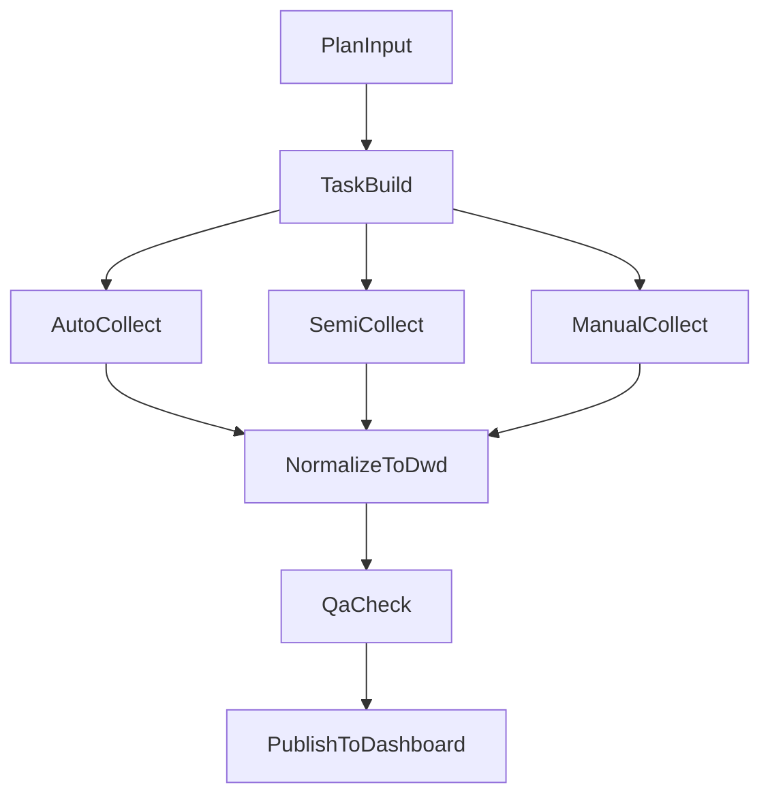
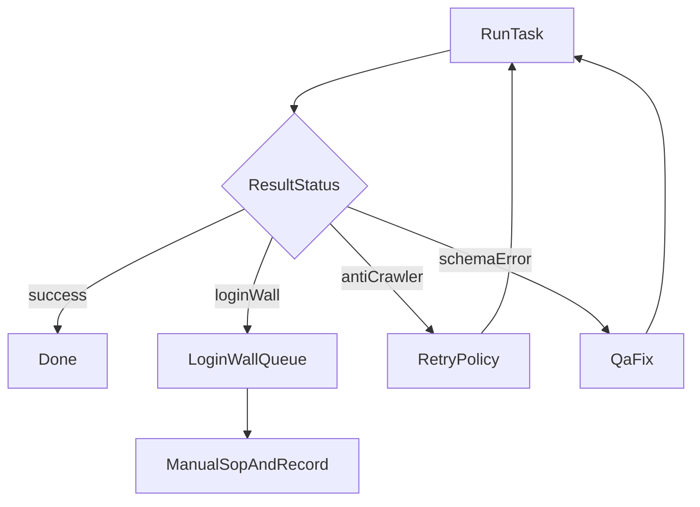

# 工作流设计图

## 1. 全流程（自动化 + 半自动 + 人工）

```mermaid
flowchart TD
  planInput[PlanInput] --> taskBuild[TaskBuild]
  taskBuild --> autoCollect[AutoCollect]
  taskBuild --> semiCollect[SemiCollect]
  taskBuild --> manualCollect[ManualCollect]
  autoCollect --> normalize[NormalizeToDwd]
  semiCollect --> normalize
  manualCollect --> normalize
  normalize --> qaCheck[QaCheck]
  qaCheck --> publish[PublishToDashboard]
```

## 2. 失败处理分支

```mermaid
flowchart TD
  runTask[RunTask] --> resultCheck{ResultStatus}
  resultCheck -->|success| done[Done]
  resultCheck -->|loginWall| loginQueue[LoginWallQueue]
  resultCheck -->|antiCrawler| retryPolicy[RetryPolicy]
  resultCheck -->|schemaError| qaFix[QaFix]
  loginQueue --> manualSop[ManualSopAndRecord]
  retryPolicy --> runTask
  qaFix --> runTask
```

## 3. 关键约束

- 所有任务必须记录状态迁移与时间戳
- 登录墙任务必须产生手工处理记录
- 进入发布前必须通过 QA 检查
