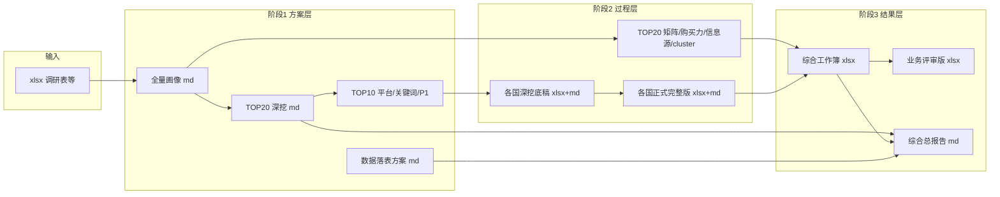

# VOC 项目架构与数据流

## 1. 业务分层（认知模型）

本项目从「画像 → 深挖 → 平台 → 关键词 → P1 作业 → 升级四表」递进，与目录 **A（方案）/ B（过程）/ C（结果）** 对应关系如下。

| 认知阶段 | 典型产出 | 物理位置（均在 `外部平台锁定/` 下） |
|----------|----------|--------------------------------------|
| 全量国家×品线画像 | 洞察报告、总结结论表 | `A_方案与标准/01_全量国家品线画像/` |
| TOP20 深挖 | 国家深挖报告/明细 | `A_方案与标准/02_TOP20国家深挖/` |
| TOP10 平台/关键词/P1 | 清单与作业单 | `A_方案与标准/03_`～`05_` 对应目录 |
| 数据落表 | schema 设计说明 | `A_方案与标准/06_数据落表方案/` |
| 升级框架与试点 | Wave2/Wave3、各国底稿与正式包、矩阵 | `B_过程与资产/09_升级国家深挖框架/` |
| 综合整合 | 综合工作簿、总报告、业务评审版 | `C_结果与交付/07_综合交付/` |

**脚本侧**：阶段化生成逻辑在 `B_过程与资产/08_生成脚本/` 下按 `01`～`07` 子目录对齐；**国家升级与并入** 的 `generate_*.py` / `integrate_*.py` 位于 `08_生成脚本/09_升级国家深挖框架/`。

## 2. 数据流（从输入到交付）

1. **输入**：国家-品线、外部调研等 **Excel** 进入 `A_方案与标准/00_输入资料与调研/`（路径常量见 `config/project_paths.INPUT_DIR`）。
2. **阶段1 文本产出**：由 `08_生成脚本` 下各 `generate_*.py` 写入 `A_方案与标准` 中对应编号目录。
3. **阶段2 升级深挖**：在 `B_过程与资产/09_升级国家深挖框架/` 生成 **底稿 → 正式完整版**，由同目录下 `integrate_*_into_master.py` **并入** 综合工作簿。
4. **阶段3 综合交付**：主文件位于 `C_结果与交付/07_综合交付/`，包括 `母婴本地化VOC舆情分析_综合工作簿.xlsx`、业务评审版、总报告与升级计划。

## 3. 与《数据落表方案》的对应关系

- **权威正文**：`A_方案与标准/06_数据落表方案/母婴本地化VOC舆情分析_数据落表方案.md`
- **综合交付中的索引版**：`C_结果与交付/07_综合交付/归档索引/母婴本地化VOC舆情分析_数据落表方案.md`（指向权威正文，避免双份漂移）
- 设计意图：将「国家×平台×关键词×P1」与 **cfg / dim / ods / dwd / dws / ads** 分层对齐，供数仓与采集迭代对照。

## 4. 路径配置说明

- 仓库根：`config.project_paths.PROJECT_ROOT`
- 资料根：`EXTERNAL_ROOT` = `PROJECT_ROOT / "外部平台锁定"`
- **勿混淆**：`FRAMEWORK_DIR` = `B_过程与资产/09_升级国家深挖框架`（数据与文档大目录）；`SCRIPTS_FRAMEWORK_DIR` = `B_过程与资产/08_生成脚本/09_升级国家深挖框架`（脚本目录）。

---

*修订时请同步检查 `config/project_paths.py` 与本文档一致。*
